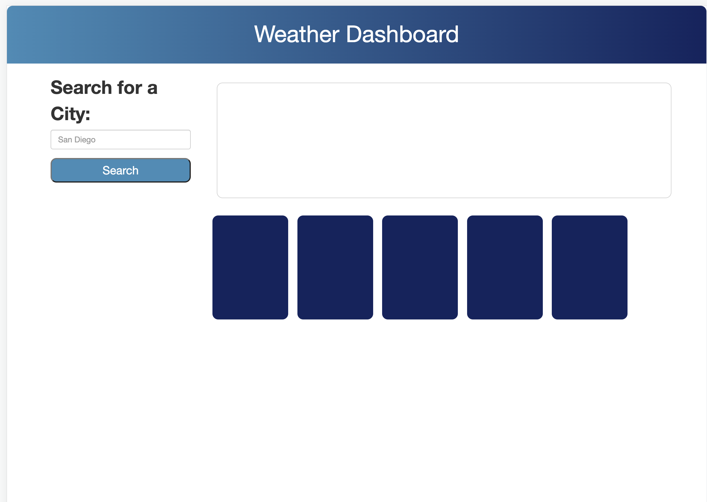
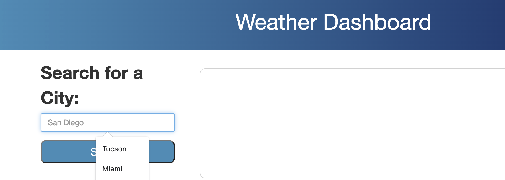
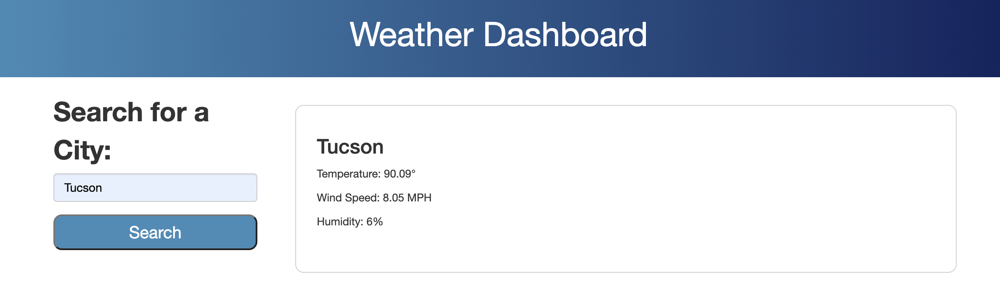

# weird-weather
Weather Dashboard

Live deployed site: https://haleyhilton.github.io/weird-weather/

This weather dashboard serves as a simple way to get the weather for any city using the openweather API: https://openweathermap.org/api

The user should type in the city they are interested in and they'll be provided with the city name, current temperature, wind speed and humidity. To be added, is current UV index and badge associated.

Additionally, the user is given five days of weather forecasts.

Ultimately, after struggling with some append elements, I chose to have the five day forecast cards display automatically rather than with an eventListener. The landing page also has a placeholder text of the owner's current city - in my case this is San Diego.

After the user searches for the city that they are interested it, it will appear in a drop down as previously searched for cities that can be selected.

Once the user hits the search button - they're met with the results of Temp, Wind Speed and Humidity. Currently working on adding the additional resources but due to project week, running short on time.
